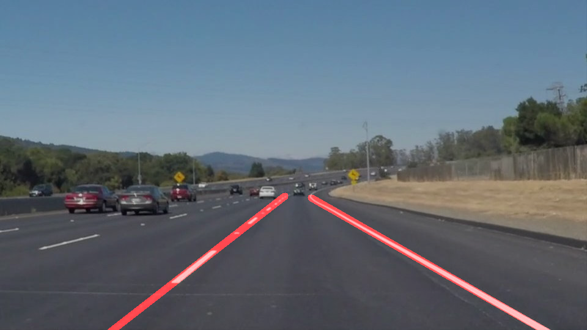
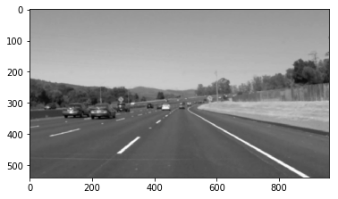
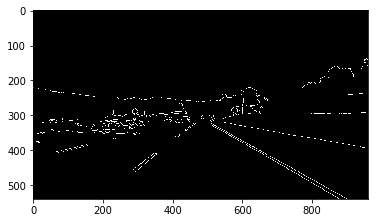
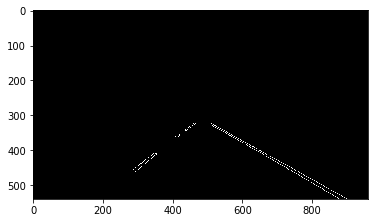
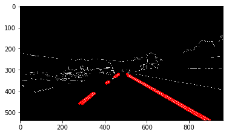
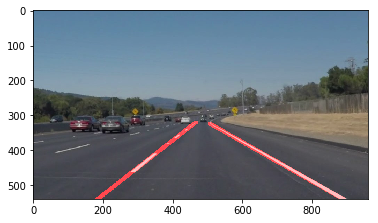

# **Finding Lane Lines on the Road** 

For Finding Lane Lines on the Road, I used OpenCV and Python

The goals / steps of this project are the following:
* Make a pipeline that finds lane lines on the road
* Pipeline used the following techniques
1. Color Conversion
2. Gaussian smoothing
3. Canny Edge Detection
4. Region of Interest Selection
5. Hough Transformation for Line Detection

Using the pipeline I can find the lane lines on both individual images and video clip.

---

## Reflection

## Example Test Image

Above Image is an example of a lane image which has white lane is a series of alternating dots and short lines, which we need to detect as one line.

## Pipeline Overview
This part descibes the various steps and techniques used in the pipeline to achieve the final outcome.

### Step 1. Color Conversion

The images are loaded in RGB color space. The image is then converted into GrayScale image.

The images should be converted into gray scale in order to detect edges in the images. 
This is because the Canny edge detection measures the magnitude of pixel intensity changes or gradients.

def grayscale(img):
    return cv2.cvtColor(img, cv2.COLOR_RGB2GRAY)

### Step 2. Gaussian smoothing

Gaussian smoothing, before running Canny, which is essentially a way of suppressing noise and spurious gradients by averaging.

def gaussian_blur(img, kernel_size)

### Step 3. Canny Edge Detection

Canny Edge Algorithm helps in detecting edges in an image.

The algorithm will first detect strong edge (strong gradient) pixels above the high_threshold, and reject pixels below the low_threshold. Next, pixels with values between the low_threshold and high_threshold will be included as long as they are connected to strong edges. The output edges is a binary image with white pixels tracing out the detected edges and black everywhere else. See the OpenCV Canny Docs for more details.

def canny(img, low_threshold, high_threshold)
	

### Step 4. Region of Interest 

When we are finding lane lines, we don't need to check all the details in the image.

We are interested only in some section of the image where we know the lanes are present.

We use masking to include only our area of interest where we can detect lane lines. 

def region_of_interest(img, vertices)

### Step 5. Hough Transformation for Line Detection

Hough Transform is to detect lines in the edge images.

We will need to weak several parameters to get desired output:

rho: Distance resolution of the accumulator in pixels.
theta: Angle resolution of the accumulator in radians.
threshold: Accumulator threshold parameter. Only those lines are returned that get enough votes (> threshold).
minLineLength: Minimum line length. Line segments shorter than that are rejected.
maxLineGap: Maximum allowed gap between points on the same line to link them.

## Averaging and Extrapolating Lines

There are multiple lane line detected for a lane line. Mainly a Left lane line and Right Lane Line.
These lane lines are only partially recognized. We should extrapolate the line to cover full lane line length.

We want two lane lines: one for the left and the other for the right. The left lane should have a positive slope, and the right lane should have a negative slope. Therefore, we'll collect positive slope lines and negative slope lines separately and take averages.

Y-coordinate is reversed in the image. The higher value of y is actually lower in the image. 
Therefore, the slope is negative for the left lane, and the slope is positive for the right lane.

def draw_lines(img, lines, color=[255, 0, 0], thickness=2):
    """
    NOTE: this is the function you might want to use as a starting point once you want to 
    average/extrapolate the line segments you detect to map out the full
    extent of the lane (going from the result shown in raw-lines-example.mp4
    to that shown in P1_example.mp4).  
    
    Think about things like separating line segments by their 
    slope ((y2-y1)/(x2-x1)) to decide which segments are part of the left
    line vs. the right line.  Then, you can average the position of each of 
    the lines and extrapolate to the top and bottom of the lane.
    
    This function draws `lines` with `color` and `thickness`.    
    Lines are drawn on the image inplace (mutates the image).
    If you want to make the lines semi-transparent, think about combining
    this function with the weighted_img() function below
    """
    slope_thresh = 0.4
    lines_left = []
    lines_right = []
    for line in lines:
        for x1,y1,x2,y2 in line:
            if((x2 - x1) != 0):
                slope = (y2 - y1)/(x2 - x1)
                if(abs(slope) >= slope_thresh):
                    if(slope > 0):
                        lines_right.append(line)
                    else:
                        lines_left.append(line)

    lines_leftright = [lines_left, lines_right]

### 2. Identify potential shortcomings with your current pipeline

One potential shortcoming would be what would happen when ... 

Another shortcoming could be ...

### 3. Suggest possible improvements to your pipeline

A possible improvement would be to ...

Another potential improvement could be to ...
