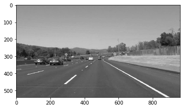

# **Finding Lane Lines on the Road** 


For Finding Lane Lines on the Road, I used OpenCV and Python

The goals / steps of this project are the following:
* Make a pipeline that finds lane lines on the road
* Pipeline used the following techniques
1. Color Conversion
2. Gaussian smoothing
3. Canny Edge Detection
4. Region of Interest Selection
5. Hough Transformation for Line Detection

Using the pipeline I can find the lane lines on both individual images and video clip.

---

## Reflection

## Example Test Image


Above Image is an example of a lane image which has white lane is a series of alternating dots and short lines, which we need to detect as one line.

## Pipeline Overview
This part descibes the various steps and techniques used in the pipeline to achieve the final outcome.

### Step 1. Color Conversion

The images are loaded in RGB color space. The image is then converted into GrayScale image.

The images should be converted into gray scale in order to detect edges in the images. 
This is because the Canny edge detection measures the magnitude of pixel intensity changes or gradients.

def grayscale(img):
    return cv2.cvtColor(img, cv2.COLOR_RGB2GRAY)



### Step 2. Gaussian smoothing

Gaussian smoothing, before running Canny, which is essentially a way of suppressing noise and spurious gradients by averaging.

def gaussian_blur(img, kernel_size)


### Step 3. Canny Edge Detection

Canny Edge Algorithm helps in detecting edges in an image.

The algorithm will first detect strong edge (strong gradient) pixels above the high_threshold, and reject pixels below the low_threshold. Next, pixels with values between the low_threshold and high_threshold will be included as long as they are connected to strong edges. The output edges is a binary image with white pixels tracing out the detected edges and black everywhere else. See the OpenCV Canny Docs for more details.

def canny(img, low_threshold, high_threshold)
	


### Step 4. Region of Interest 

When we are finding lane lines, we don't need to check all the details in the image.

We are interested only in some section of the image where we know the lanes are present.

We use masking to include only our area of interest where we can detect lane lines. 

def region_of_interest(img, vertices)


### Step 5. Hough Transformation for Line Detection

Hough Transform is to detect lines in the edge images.

We will need to weak several parameters to get desired output:

rho: Distance resolution of the accumulator in pixels.
theta: Angle resolution of the accumulator in radians.
threshold: Accumulator threshold parameter. Only those lines are returned that get enough votes (> threshold).
minLineLength: Minimum line length. Line segments shorter than that are rejected.
maxLineGap: Maximum allowed gap between points on the same line to link them.


## Averaging and Extrapolating Lines

There are multiple lane line detected for a lane line. Mainly a Left lane line and Right Lane Line.
These lane lines are only partially recognized. We should extrapolate the line to cover full lane line length.

We want two lane lines: one for the left and the other for the right. The left lane should have a positive slope, and the right lane should have a negative slope. Therefore, we'll collect positive slope lines and negative slope lines separately and take averages.

Y-coordinate is reversed in the image. The higher value of y is actually lower in the image. 
Therefore, the slope is negative for the left lane, and the slope is positive for the right lane.

I have chosen a minimum threshold value of the slope to be identified as lines in and it is 0.4 (slope_thresh).

```
slope_thresh = 0.4
lines_left = []
lines_right = []
for line in lines:
    for x1,y1,x2,y2 in line:
        if((x2 - x1) != 0):
            slope = (y2 - y1)/(x2 - x1)
            if(abs(slope) >= slope_thresh):
                if(slope > 0):
                    lines_right.append(line)
                else:
                    lines_left.append(line)

lines_leftright = [lines_left, lines_right]

```

Once we get the left and right lanes we get the coeffecients m and b of the line (y = mx + b) using np.polyfit function and 1st degree polynominal equation of the line using  np.poly1d.

These two helps us in getting the various x and y co-ordinates on the left and right lane lines. 

```
for a in range(0, 2):
        x = []
        y = []
        for line in lines_leftright[a]:
            for x1, y1, x2, y2 in line:
                x += [x1, x2]
                y += [y1, y2]

        #Get coeficients for y = mx + b
        z = np.polyfit(x, y, 1)
        f = np.poly1d(z)

        x_pts=[]
        y_pts=[]
```

###Extrapolation

Then to extrapolate the lines properly for left line we need to choose a minimum value to make sure it touches the bottom of the image. So we choose minimum of x for left lane line as 0. 

Also, we don't choose any points which are higher than the top line of the masked area (in this case it is 320). 


```
		if(a == 0):
            minx = 0 # For Left Lines consider minimum = 0
        else:
            minx = min(x) # For right lines ignore min = 0

        for i in range(minx, max(x)):
            if(f(i) >= 320):
                x_pts += [int(i)]
                y_pts += [int(f(i))]
```

For the right lane line we need to check if there is a point touching bottom of the image. If not then we find a x-coordinate using equation 
x = (y - c )/ m. y = 540 (bottom of image) and then append them.

```
		#if there is no y-axis point which exists
        #which is touching the bottom of image (i.e height)
        #then find a point on the line which tocuhes the bottom 
        if(np.amax(y_pts) < 540):
            #x = (y - c )/ m
            x = (540 - z[1]) / z[0]
            x_pts +=[int(x)]
            y_pts +=[540]
```

Lastly we pack all the points together and draw the lines for the lanes.

```
		#pack all the points together
        points = list(zip(x_pts, y_pts))
        
        #iterate through all the points and create a line
        #connecting to them
        for i in range(1, len(points)):
            px, py = points[i-1]
            cx, cy = points[i]
            cv2.line(img, (int(px), int(py)), (int(cx), int(cy)), color, thickness)

```
The images are taken from test_images folder and output is stored in test_images_output folder. Below is the final output we get.


For the Video Clips the same pipeline when used creates the output Video Clips in 
test_videos_output folder.

```
def process_image(image):
    result = pipeline(image)
    return result
    
directory = "test_videos_output"
if not os.path.exists(directory):
    os.makedirs(directory)
    
white_output = 'test_videos_output/solidWhiteRight.mp4'
clip1 = VideoFileClip("test_videos/solidWhiteRight.mp4")
white_clip = clip1.fl_image(process_image)
%time white_clip.write_videofile(white_output, audio=False)
```

### 2. Identify potential shortcomings with your current pipeline

One potential shortcoming is it's only able to detect straight lane lines. It won't be able to handle the curved lanes. 

Other shortcoming is it won't be able to detect steep lane lines since our Region of Interest is mostly in the middle part of the image.

### 3. Suggest possible improvements to your pipeline

A possible improvement would be to identify the steep and curved lane lines. We would need to detect the lane lines with some height logic connected to straight lines. 

For Curved lane lines, we would need to consider perspective transformation to handle it. 
